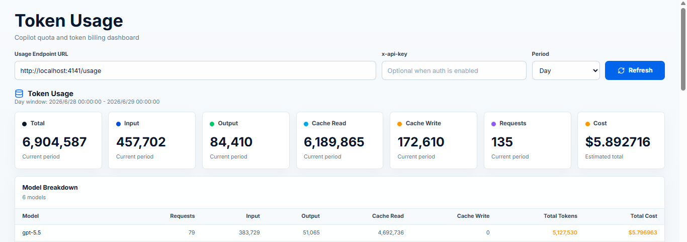

# Usage Monitoring

[Home](../../../README.md) · [Documentation](README.md) · [简体中文](../zh-CN/usage.md)

## Using the Usage Viewer

After starting the server, a URL to the Copilot Usage Dashboard will be displayed in your console. This dashboard is a web interface for monitoring your API usage.

1.  Start the server. For example, using npx:
    ```sh
    npx @jeffreycao/copilot-api@latest start
    ```
2.  The server will output a URL to the usage viewer. Copy and paste this URL into your browser. It will look something like this:
    `http://localhost:4141/usage-viewer?endpoint=http://localhost:4141/usage`
    - If you use the `start.bat` script on Windows, this page will open automatically.

The dashboard provides a user-friendly interface to view your Copilot usage data:

> Token usage history requires Bun or Node.js >= 22.13.0. On older Node.js versions the server runs normally but token usage storage is disabled.

- **API Endpoint URL**: The dashboard is pre-configured to fetch data from your local server endpoint via a URL query parameter. You can manually switch this to any other compatible API endpoint.
- **API Key Authentication**: If API Key authentication is enabled, enter a raw API key (sent as the `x-api-key` header) or `Authorization: Bearer <key>`. Credentials are remembered in the browser's local storage per endpoint origin, and switching to a different endpoint origin does not automatically send the previous credential.
- **Period Selector**: Choose from six time ranges: `today` (the current local calendar day so far), `this_week` (Monday at 00:00 through now), `last_7_days` (the rolling seven calendar days through now), `this_month` (the first day of the current month at 00:00 through now), `last_30_days` (the rolling 30 calendar days through now), and `lifetime` (the earliest recorded event through now). Today is selected by default, and the exact date range appears next to the selector. The URL query parameter updates automatically when you switch, making it easy to bookmark and share. The legacy values `day`, `week`, and `month` are still accepted and mapped to their new equivalents.
- **Fetch Data**: Click the "Refresh" button to load or refresh the usage data. The dashboard also fetches data automatically on page load.
- **Copilot Quotas**: View quota usage for services such as Chat and Completions via progress bars. Hover over a card to see used/remaining details.
- **Token Usage Metric Cards**: See a summary of Total, Input, Output, Cache Read, Cache Write, Requests, and estimated cost for the current period.
- **Trend Chart**: An interactive line chart with model and metric filters for the selected period. Click a data point to inspect the usage breakdown for a day; Lifetime chart data is sampled from the daily buckets and capped at 180 points for readability.
- **Model Breakdown Table**: A per-model summary of requests, input/output/cache tokens, and estimated cost for the selected period.
- **Request Events (Paginated)**: A time-sorted list of request event records with pagination support, showing timestamps, models, request IDs, and token counts.
- **Detailed Information**: See the full JSON response from the API for a detailed breakdown of all available usage statistics.
- **Theme**: The page follows your system's light or dark setting. The button at the top right cycles Auto → Light → Dark, and the choice is remembered in this browser for this origin.
- **URL-based Configuration**: You can also specify the API endpoint and period directly via `endpoint` and `period` query parameters. For example:
  `http://localhost:4141/usage-viewer?endpoint=http://your-api-server/usage&period=this_week`

### Usage Viewer Screenshot

<p align="center">
  
</p>
